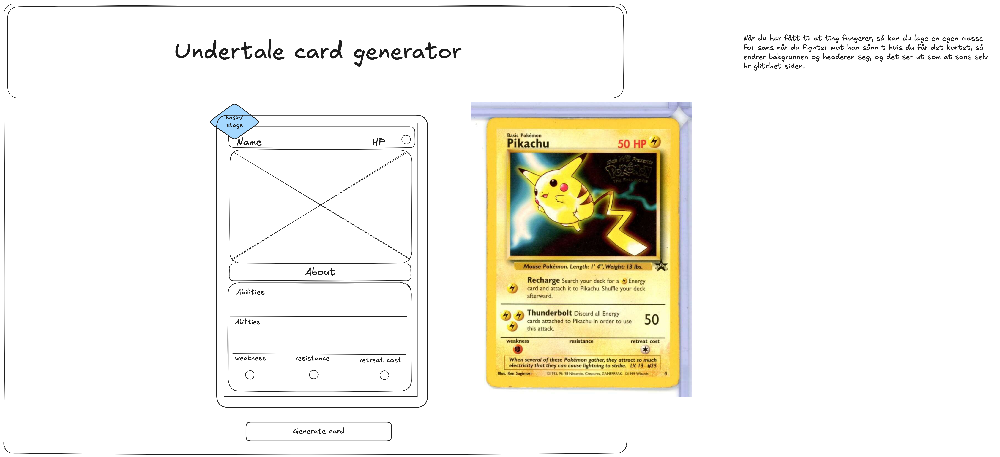

# Undertale pokemon card creator

This program will be an api which will take undertale characters and generate pokemon cards for them. It will both do it for regular monsters and boss monsters, and it will also include gen version,
something about randomness in this must be equated for and need to put into it.

the plan is to create basic cards for all the monsters, then special cards for the evolved characters.
Stages are:

- Pacifist
- Neutral
- Genocide

Need to to do:

- create a card to see how it looks
- make logic for the card so it switches between which abilities and attacks it displays
- connect it to the backend so it can be changed what type of card is displayed - js and c#?
- create/add all the monsters to a json document
- create the randomness logic for when the card switches
- set up for logic to run through the card
- eirik had the idea to add affinity instead of weakness and resistance, so different monsters have different affinities to how you should act and more easily befriend them, like patting the greater dog
- add gradient to the cards

have different categories for different cards, fex three categories, where you have the same styling

